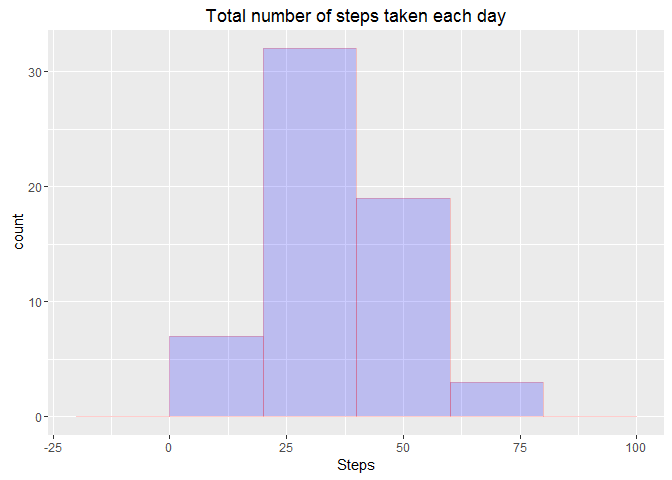
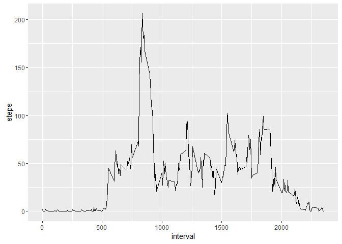

# Reproducible Research: Peer Assessment 1


## Loading and preprocessing the data

##### 1. Check if file unzipped before
##### 2. Unzip the data set file if not exists
##### 3. Read the csv file into a data frame


```r
if(!file.exists('activity.csv')) {
  
  unzip('activity.zip')
}

# Load the csv to a data frame
data <- read.csv("activity.csv", sep=",", colClasses = "character")
```


## What is mean total number of steps taken per day?

##### 1. Changing data types of steps from character to numeric and date from character to date
##### 2. Calculating the mean and median of steps for each day


```r
# Convert steps to numeric
data$steps <- as.numeric(data$steps)

# Convert date data to date format
data$date <- as.Date(data$date)

# Aggregate steps
data2 <- aggregate(steps ~ date, data, sum)

# Calculating Total Mean and Median
dataMean <- mean(data2[,"steps"])
dataMedian <- median(data2[,"steps"])
```

#### The Histogram of "Total number of steps taken each day"


```r
library(ggplot2)
qplot(data2$steps, geom="histogram", main="Total number of steps taken each day", binwidth=1000, xlab="Steps", fill=I("blue"), col=I("red"), alpha=I(.2))
```


#### The total mean is: 10766.19
#### The total median is: 10765


## What is the average daily activity pattern?

##### 1. Change data type of interval to numeric
##### 2. Group steps by interval, and summarize by mean
##### 3. Plot a histogram of average steps per interval


```r
data$interval <- as.numeric(data$interval)
dataAverages <- aggregate(steps ~ interval, data, mean, na.rm=TRUE)
ggplot(dataAverages, aes(interval, steps)) + geom_line()
```


```r
  row <- dataAverages[which(dataAverages$steps == max(dataAverages$steps, na.rm=TRUE)),]
  maxAverageInterval <- row$interval
```
#### The time interval that contains the maximum number of steps: 835

## Imputing missing values

### Calculating the total number of missing values in the dataset

```r
  naData <- subset(data, is.na(data$steps)|is.na(data$interval))
  naDataCount <- nrow(naData)
```

#### The total number of missing values in the dataset: 2304

##### 1. Group data by interval and summarize steps by mean
##### 2. For each step in data, if step is na, get the mean of steps of the same interval


```r
dataImputted <- data

dataImputted$interval <- as.numeric(dataImputted$interval)
dataImputted$steps <- as.numeric(dataImputted$steps)

dataMeanPerInterval <- aggregate(steps ~ interval, dataImputted, mean, rm.na=TRUE)

dataImputted$steps <- apply(dataImputted, 1, function(x)
	{
  	steps <- as.numeric(x["steps"])
  	interval <- as.numeric(x["interval"])
  
    if(is.na(steps)) {
      
      stepsMean <- dataMeanPerInterval$steps[(dataMeanPerInterval$interval == interval)]
      
      # print(class(stepsMean))

      x["steps"] <- stepsMean
    }
  
    as.numeric(x["steps"])
		
	})

dataImputtedAggregated <- aggregate(steps ~ date, dataImputted, mean, rm.na=TRUE)
```

#### Histogram of the total number of steps taken each day after data are imputted:


```r
qplot(dataImputtedAggregated$steps, geom="histogram", main="Total number of steps taken each day", binwidth=20, xlab="Steps", fill=I("blue"), col=I("red"), alpha=I(.2))
```




## Are there differences in activity patterns between weekdays and weekends?

##### 1. Using Imputed data
##### 2. Convert date column to data data type
##### 3. Use function weekdays() to know day names of date
##### 4. Add new column to specifiy if day is weekend or not


```r
  # library(dplyr, quietly = TRUE)

  dataWithWeekDays <- dataImputted

  dataWithWeekDays$date <- as.Date(dataWithWeekDays$date)

  dataWithWeekDays$weekDays <- weekdays(dataWithWeekDays$date)
  
  
  dataWithWeekDays$dayType <- as.factor(with(dataWithWeekDays, ifelse(weekDays == 'Sunday', 'weekend', ifelse(weekDays == 'Saturday', 'weekend', 'weekday'))))
  
  # print(dataWithWeekDays)
  
  # dataWithWeekDaysAggregated <- dataWithWeekDays %>% group_by(interval) %>% summarise(steps=mean(steps, rm.na=TRUE))
  
  dataWithWeekDaysAggregated <- aggregate(steps ~ interval+dayType, dataWithWeekDays, mean, rm.nam=TRUE)
  # print(dataWithWeekDaysAggregated)
  
   ggplot(dataWithWeekDaysAggregated, aes(interval, steps)) + geom_line(linetype=1) + facet_wrap(~dayType, ncol=1)
```


