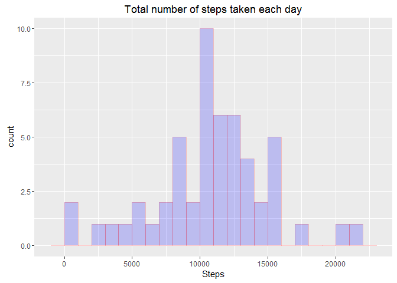

# Reproducible Research: Peer Assessment 1


## Loading and preprocessing the data

```r
# Check if file unzipped before
if(!file.exists('activity.csv')) {
  
  #Unzip the data set file
  unzip('activity.zip')
}

# Load the csv to a data frame
data <- read.csv("activity.csv", sep=",", colClasses = "character")
```


## What is mean total number of steps taken per day?

```r
# Convert steps to numeric
data$steps <- as.numeric(data$steps)

# Convert date data to date format
data$date <- as.Date(data$date)

# Aggregate steps
data2 <- aggregate(steps ~ date, data, sum)

# Calculating Total Mean and Median
dataMean <- mean(data2[,"steps"])
dataMedian <- median(data2[,"steps"])
```

#### The Histogram of "Total number of steps taken each day"

```r
library(ggplot2)
qplot(data2$steps, geom="histogram", main="Total number of steps taken each day", binwidth=1000, xlab="Steps", fill=I("blue"), col=I("red"), alpha=I(.2))
```



#### The total mean is: 10766.19
#### The total median is: 10765


## What is the average daily activity pattern?


```r
library(dplyr)
data$interval <- as.numeric(data$interval)
dataAverages <- data %>% group_by(interval) %>% summarize(mean(steps))
```


## Imputing missing values


## Are there differences in activity patterns between weekdays and weekends?
